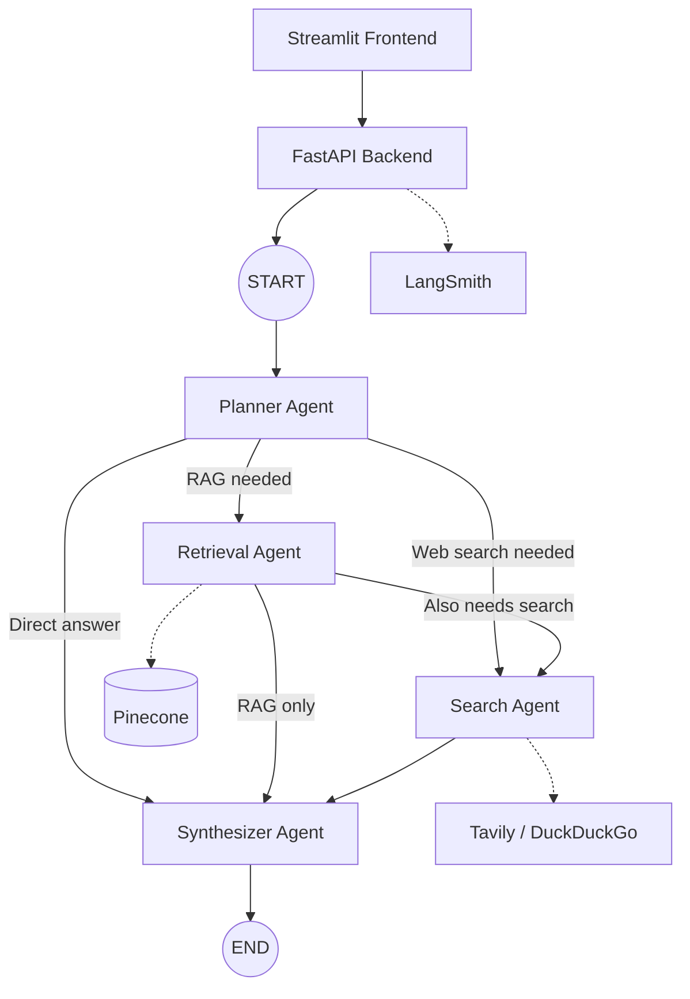

# Multi-Agent AI Orchestrator

A production-oriented multi-agent AI system that routes user queries through a **LangGraph** workflow — planning intent, retrieving from a vector store, searching the web, and synthesizing cited answers. Built with **FastAPI**, **Streamlit**, **Pinecone**, and **LangSmith**, and designed to run on **free-tier providers** with zero paid infrastructure required.

---

## Overview

This project demonstrates end-to-end LLMOps patterns: agent orchestration, retrieval-augmented generation (RAG), web search integration, observability, and cloud deployment. A **Planner** agent analyses each query and dynamically routes execution through **Retrieval**, **Search**, and **Synthesizer** agents before returning a grounded, citation-style response.

| Capability | Implementation |
|---|---|
| Agent orchestration | LangGraph `StateGraph` with conditional routing |
| LLM inference | Groq (default), OpenAI, or Ollama |
| Vector search | Pinecone with HuggingFace embeddings |
| Web search | Tavily with DuckDuckGo fallback |
| Observability | LangSmith tracing + in-process metrics |
| API | FastAPI (`/chat`, `/upload`, `/health`, `/metrics`) |
| UI | Streamlit chat interface with document upload |
| Deployment | Docker, Docker Compose, Render.com |

---

## Architecture



**Workflow**

1. **Planner** — Analyses intent, classifies complexity, and emits a structured execution plan.
2. **Retrieval** — Embeds the query and retrieves top-k chunks from Pinecone (with in-memory fallback).
3. **Search** — Runs Tavily or DuckDuckGo queries, filters and deduplicates results.
4. **Synthesizer** — Merges all context into a final answer with source citations.

---

## Tech Stack

| Layer | Technologies |
|---|---|
| Orchestration | LangGraph, LangChain |
| Backend | FastAPI, Uvicorn, Pydantic Settings |
| Frontend | Streamlit |
| LLM | Groq, OpenAI, Ollama |
| Embeddings | HuggingFace `sentence-transformers` |
| Vector DB | Pinecone |
| Search | Tavily, DuckDuckGo |
| Observability | LangSmith, custom in-process metrics |
| Documents | PyPDF, Unstructured |
| Containerisation | Docker, Docker Compose |
| Cloud | Render.com (Blueprint included) |

---

## Prerequisites

- Python 3.11+
- [Groq API key](https://console.groq.com) (minimum — free tier)
- Optional: [Pinecone](https://www.pinecone.io), [Tavily](https://tavily.com), [LangSmith](https://smith.langchain.com) API keys

---

## Quick Start

### 1. Clone and install

```bash
git clone <your-repo-url>
cd "multi-agent ai system with llmops"
python -m venv venv

# Windows
venv\Scripts\activate

# macOS / Linux
source venv/bin/activate

pip install -r requirements.txt
```

### 2. Configure environment

```bash
cp .env.example .env
```

At minimum, set `GROQ_API_KEY` in `.env`. See [Environment Variables](#environment-variables) for the full list.

### 3. Run locally

**Terminal 1 — API**

```bash
uvicorn src.api.fastapi_app:app --host 0.0.0.0 --port 8000 --reload
```

**Terminal 2 — UI**

```bash
streamlit run frontend/streamlit_app.py
```

| Service | URL |
|---|---|
| Streamlit UI | http://localhost:8501 |
| API | http://localhost:8000 |
| Swagger docs | http://localhost:8000/docs |
| Health check | http://localhost:8000/health |

---

## Docker

Run the full stack with a single command:

```bash
cp .env.example .env   # add your API keys
docker compose up --build
```

The API container waits for a healthy `/health` response before the Streamlit frontend starts. Source is volume-mounted for development hot-reload.

---

## Deploy to Render

This project ships with a [Render Blueprint](https://render.com/docs/blueprint-spec) (`render.yaml`) for one-click API deployment.

1. Push the repository to GitHub.
2. In the Render dashboard, create a **New Blueprint** and connect the repo.
3. Set the required secrets when prompted:
   - `GROQ_API_KEY` (required)
   - `PINECONE_API_KEY`, `TAVILY_API_KEY`, `LANGSMITH_API_KEY` (recommended)
4. Deploy — Render builds from `Dockerfile` and runs `start.sh`.

**Production optimisations included**

- Non-blocking startup via FastAPI lifespan (prevents 502 on health checks)
- Blocking workflow calls offloaded to a thread pool
- CPU-only PyTorch wheels to reduce image size and memory
- HuggingFace cache directed to `/tmp` for ephemeral disk compatibility
- Health check at `/health` with extended start period

> **Note:** The Blueprint deploys the API only. Run Streamlit locally or on a separate service, pointing `API_BASE_URL` at your Render URL.

---

## Environment Variables

### Required

| Variable | Description |
|---|---|
| `GROQ_API_KEY` | Primary LLM provider — [console.groq.com](https://console.groq.com) |

### Recommended

| Variable | Default | Description |
|---|---|---|
| `PINECONE_API_KEY` | — | Vector database for RAG |
| `PINECONE_INDEX_NAME` | `ai-orchestrator` | Pinecone index name (auto-created) |
| `TAVILY_API_KEY` | — | Web search (1,000 req/month free) |
| `LANGSMITH_API_KEY` | — | Tracing and observability |
| `LANGSMITH_PROJECT` | `ai-orchestrator` | LangSmith project name |

### Optional

| Variable | Default | Description |
|---|---|---|
| `OPENAI_API_KEY` | — | Use OpenAI instead of Groq |
| `GROQ_MODEL` | `llama-3.1-8b-instant` | Groq model identifier |
| `HF_EMBEDDING_MODEL` | `sentence-transformers/all-MiniLM-L6-v2` | Local embedding model |
| `LOG_LEVEL` | `INFO` | Application log level |
| `PORT` | `8000` | API port (auto-injected on Render) |
| `API_BASE_URL` | `http://localhost:8000` | API URL for the Streamlit frontend |

---

## API Reference

### `POST /chat`

Run the full multi-agent workflow.

```json
{
  "query": "What is LangGraph?",
  "messages": [
    {"role": "user", "content": "Tell me about AI agents"},
    {"role": "assistant", "content": "AI agents are..."}
  ],
  "session_id": "optional-uuid"
}
```

**Response**

```json
{
  "answer": "LangGraph is a library for building stateful agent workflows...",
  "sources": [{"title": "...", "url": "...", "type": "web"}],
  "metadata": {"plan": {}, "rag_chunks_used": 2},
  "session_id": "uuid"
}
```

### `POST /upload`

Upload a document (PDF, TXT, Markdown) via `multipart/form-data`. The file is chunked, embedded, and upserted into Pinecone.

### `GET /health`

Returns service status, version, active port, and configured provider summary. Used by Docker and Render health checks.

### `GET /metrics`

Returns in-process counters, latency histograms, and error counts.

---

## Agents

### Planner

Analyses user intent with an LLM call and outputs a structured JSON execution plan. Determines whether to route through RAG, web search, both, or neither. Classifies query complexity as low, medium, or high.

### Retrieval

Embeds the query with HuggingFace or OpenAI, queries Pinecone for top-k similar chunks, and optionally re-ranks results with the LLM. Falls back to in-memory keyword search when Pinecone is unavailable.

### Search

Executes Tavily searches (with DuckDuckGo fallback), supports multi-query parallelism, and applies LLM-based relevance filtering. Returns deduplicated, ranked snippets.

### Synthesizer

Merges RAG context and web search results into a single cited answer. Respects conversation history and uses temperature tuned for accuracy and readability.

---

## Project Structure

```
.
├── src/
│   ├── api/
│   │   └── fastapi_app.py          # REST API and Render-compatible lifespan
│   ├── graph/
│   │   ├── graph_builder.py        # LangGraph StateGraph construction
│   │   ├── graph_state.py          # AgentState TypedDict
│   │   └── nodes.py                # Node functions and conditional routing
│   ├── agents/
│   │   ├── planner_agent.py
│   │   ├── retrieval_agent.py
│   │   ├── search_agent.py
│   │   └── synthesizer_agent.py
│   ├── llm/
│   │   ├── llm_factory.py          # Groq / OpenAI / Ollama factory
│   │   └── prompts.py
│   ├── retrieval/
│   │   ├── pinecone_client.py
│   │   ├── embeddings.py
│   │   ├── ingest.py
│   │   └── retriever.py
│   ├── search/
│   │   └── web_search.py
│   ├── observability/
│   │   └── langsmith_tracing.py
│   ├── monitoring/
│   │   └── metrics.py
│   └── config/
│       ├── settings.py
│       └── logging_config.py
├── frontend/
│   └── streamlit_app.py
├── data/uploads/                   # Uploaded document storage
├── tests/
│   └── test_workflow.py
├── Dockerfile
├── docker-compose.yml
├── render.yaml                     # Render Blueprint
├── start.sh                        # Production entrypoint
├── requirements.txt
└── .env.example
```

---

## Testing

Tests use mocks and do not require live API keys:

```bash
pytest tests/test_workflow.py -v
```

Coverage includes graph routing logic, agent node behaviour, state management, and API response shapes.

---

## Observability

### LangSmith

1. Create a project at [smith.langchain.com](https://smith.langchain.com).
2. Add `LANGSMITH_API_KEY` and `LANGSMITH_PROJECT` to `.env`.
3. Agent runs and graph executions are traced automatically.

### In-process metrics

`GET /metrics` exposes request counts, latency timers, and error rates — useful for lightweight monitoring without external infrastructure.

---

## Free-Tier Provider Summary

| Component | Provider | Free tier |
|---|---|---|
| LLM | [Groq](https://console.groq.com) | Generous RPM/TPM limits |
| Embeddings | HuggingFace (local) | Unlimited |
| Vector DB | [Pinecone Starter](https://www.pinecone.io) | 1 index, 100k vectors |
| Web search | [Tavily](https://tavily.com) | 1,000 searches/month |
| Fallback search | DuckDuckGo | Unlimited |
| Tracing | [LangSmith](https://smith.langchain.com) | 5,000 traces/month |
| Local LLM | [Ollama](https://ollama.com) | Unlimited (self-hosted) |

No Redis, Prometheus, or paid cloud services are required for the core workflow.

---

## Roadmap

- [ ] Parallel retrieval and search execution
- [ ] Streaming responses via Server-Sent Events
- [ ] Multi-turn memory with conversation summarisation
- [ ] Agent self-reflection / critique loop
- [ ] OpenTelemetry integration
- [ ] Kubernetes Helm chart
- [ ] Per-user Pinecone namespace isolation
- [ ] Hybrid BM25 + dense retrieval
- [ ] Evaluation harness with RAGAS

---

## License

MIT

---

*Built as a portfolio-grade demonstration of production AI orchestration and LLMOps architecture.*


<!--
# 🤖 Multi-Agent AI Orchestrator

> Production-ready multi-agent AI system built with **LangGraph**, **LangChain**, **Pinecone**, **LangSmith**, **FastAPI**, and **Streamlit**.  
> Fully **free-tier friendly** — runs with Groq LLM, HuggingFace embeddings, Pinecone Starter, Tavily, and LangSmith free plans.

---

## 🏗️ Architecture

```
┌──────────────────────────────────────────────────────────────────────┐
│                     Multi-Agent AI Orchestrator                      │
│                                                                      │
│   ┌──────────────┐    ┌────────────────────────────────────────────┐ │
│   │  Streamlit   │    │              LangGraph Workflow            │ │
│   │   Frontend   │───►│                                            │ │
│   └──────────────┘    │  START                                     │ │
│                       │    │                                       │ │
│   ┌──────────────┐    │    ▼                                       │ │
│   │   FastAPI    │    │  [🧠 Planner Agent]                        │ │
│   │   Backend    │    │    │  Analyse intent · Decide strategy     │ │
│   └──────────────┘    │    │                                       │ │
│                       │    ▼ (conditional routing)                 │ │
│   ┌──────────────┐    │    ├──► [📚 Retrieval Agent]               │ │
│   │  LangSmith   │    │    │         │  Pinecone semantic search   │ │
│   │  Tracing     │    │    │         │                             │ │
│   └──────────────┘    │    │         ▼ (if search also needed)     │ │
│                       │    └──► [🌐 Search Agent]                  │ │
│   ┌──────────────┐    │              │  Tavily / DuckDuckGo        │ │
│   │  Pinecone    │    │              │                             │ │
│   │  Vector DB   │    │              ▼                             │ │
│   └──────────────┘    │         [✍️ Synthesizer Agent]             │ │
│                       │              │  Merge · Cite · Answer      │ │
│   ┌──────────────┐    │              │                             │ │
│   │ Tavily/DDG   │    │             END                            │ │
│   │ Web Search   │    └────────────────────────────────────────────┘ │
│   └──────────────┘                                                   │
└──────────────────────────────────────────────────────────────────────┘
```

---

## 🚀 Quick Start

### 1. Clone & install

```bash
git clone <your-repo-url>
cd ai-orchestrator
python -m venv venv && source venv/bin/activate  # Windows: venv\Scripts\activate
pip install -r requirements.txt
```

### 2. Configure environment

```bash
cp .env.example .env
# Edit .env — at minimum set GROQ_API_KEY (free)
```

### 3. Start services

**Terminal 1 — FastAPI backend:**
```bash
uvicorn src.api.fastapi_app:app --host 0.0.0.0 --port 8000 --reload
```

**Terminal 2 — Streamlit frontend:**
```bash
streamlit run frontend/streamlit_app.py
```

Open **http://localhost:8501** in your browser.

---

## 🐳 Docker (single command)

```bash
cp .env.example .env   # fill in your keys
docker-compose up --build
```

| Service   | URL                    |
|-----------|------------------------|
| Frontend  | http://localhost:8501  |
| API       | http://localhost:8000  |
| API Docs  | http://localhost:8000/docs |

---

## 🔑 Environment Variables

### Required (minimum viable setup)

| Variable | Description | Where to get |
|----------|-------------|--------------|
| `GROQ_API_KEY` | Primary LLM provider (free) | [console.groq.com](https://console.groq.com) |

### Recommended (full feature set)

| Variable | Description | Where to get |
|----------|-------------|--------------|
| `PINECONE_API_KEY` | Vector database for RAG | [pinecone.io](https://www.pinecone.io) |
| `TAVILY_API_KEY` | Web search (1k req/month free) | [tavily.com](https://tavily.com) |
| `LANGSMITH_API_KEY` | Tracing & observability (free) | [smith.langchain.com](https://smith.langchain.com) |

### Optional

| Variable | Description |
|----------|-------------|
| `OPENAI_API_KEY` | OpenAI LLM (paid — overrides Groq) |
| `GROQ_MODEL` | Groq model name (default: `llama-3.1-8b-instant`) |
| `HF_EMBEDDING_MODEL` | HuggingFace embedding model (default: `all-MiniLM-L6-v2`) |
| `PINECONE_INDEX_NAME` | Pinecone index name (default: `ai-orchestrator`) |
| `LANGSMITH_PROJECT` | LangSmith project name (default: `ai-orchestrator`) |

---

## 🆓 Free-Tier Providers

| Component | Provider | Free Tier |
|-----------|----------|-----------|
| 🧠 LLM | [Groq](https://console.groq.com) | Generous RPM/TPM limits |
| 🧮 Embeddings | HuggingFace sentence-transformers | Unlimited (local) |
| 🗄️ Vector DB | [Pinecone Starter](https://www.pinecone.io) | 1 index · 100k vectors |
| 🔍 Web Search | [Tavily](https://tavily.com) | 1,000 searches/month |
| 🔍 Fallback Search | DuckDuckGo | Unlimited |
| 📡 Tracing | [LangSmith](https://smith.langchain.com) | 5k traces/month |
| 🖥️ Local LLM | [Ollama](https://ollama.com) | Unlimited (local) |

**No Redis. No Prometheus. No paid infrastructure.**

---

## 🧠 Agent Details

### Agent 1: Planner
- Analyses user intent with an LLM call
- Outputs structured JSON execution plan
- Determines routing: RAG-only / search-only / both / neither
- Complexity classification: low / medium / high

### Agent 2: Retrieval
- Embeds the query with HuggingFace / OpenAI
- Queries Pinecone for top-k similar chunks
- Optional LLM re-ranking of results
- Graceful fallback to in-memory keyword search

### Agent 3: Search
- Executes Tavily searches (falls back to DuckDuckGo)
- Supports multi-query parallelism
- LLM-based result filtering and relevance scoring
- Returns deduplicated, ranked snippets

### Agent 4: Synthesizer
- Merges RAG context + web search results
- Generates citation-style answer with `[Source: url]` references
- Awareness of conversation history
- Temperature tuned for accurate yet readable prose

---

## 📁 Project Structure

```
ai-orchestrator/
├── src/
│   ├── api/
│   │   └── fastapi_app.py          # REST endpoints: /chat /upload /health /metrics
│   ├── graph/
│   │   ├── graph_builder.py        # LangGraph StateGraph construction
│   │   ├── graph_state.py          # AgentState TypedDict
│   │   └── nodes.py                # Node functions + conditional routing
│   ├── agents/
│   │   ├── planner_agent.py        # Agent 1: intent analysis & planning
│   │   ├── retrieval_agent.py      # Agent 2: Pinecone RAG
│   │   ├── search_agent.py         # Agent 3: web search
│   │   └── synthesizer_agent.py    # Agent 4: answer synthesis
│   ├── llm/
│   │   ├── llm_factory.py          # Multi-provider LLM factory (Groq/OpenAI/Ollama)
│   │   └── prompts.py              # All agent prompt templates
│   ├── retrieval/
│   │   ├── pinecone_client.py      # Pinecone CRUD operations
│   │   ├── embeddings.py           # Embedding model factory
│   │   ├── ingest.py               # Document ingestion pipeline
│   │   └── retriever.py            # High-level retrieval interface
│   ├── search/
│   │   └── web_search.py           # Tavily + DuckDuckGo
│   ├── observability/
│   │   └── langsmith_tracing.py    # LangSmith utilities + WorkflowTracer
│   ├── monitoring/
│   │   └── metrics.py              # Lightweight in-process metrics
│   └── config/
│       ├── settings.py             # Pydantic settings (env-driven)
│       └── logging_config.py       # Structured logging setup
├── frontend/
│   └── streamlit_app.py            # Chat UI + file upload + metrics
├── data/uploads/                   # Uploaded document storage
├── tests/
│   └── test_workflow.py            # Pytest test suite
├── Dockerfile
├── docker-compose.yml
├── requirements.txt
└── .env.example
```

---

## 🧪 Running Tests

```bash
pytest tests/test_workflow.py -v
```

Tests use mocks — **no API keys required** for the test suite.

---

## 📡 API Reference

### `POST /chat`
```json
{
  "query": "What is LangGraph?",
  "messages": [
    {"role": "user", "content": "Tell me about AI"},
    {"role": "assistant", "content": "AI is..."}
  ]
}
```
Response:
```json
{
  "answer": "LangGraph is a...",
  "sources": [{"title": "...", "url": "...", "type": "web"}],
  "metadata": {"plan": {...}, "rag_chunks_used": 2},
  "session_id": "uuid"
}
```

### `POST /upload`
Upload a PDF, TXT, or Markdown file via `multipart/form-data`.

### `GET /health`
Returns service status and provider configuration.

### `GET /metrics`
Returns counters, latency histograms, and error counts.

---

## 🔭 LangSmith Setup

1. Sign up at [smith.langchain.com](https://smith.langchain.com)
2. Create a project named `ai-orchestrator`
3. Copy your API key to `.env`
4. All agent runs and graph executions are automatically traced

---

## 🗄️ Pinecone Setup

1. Sign up at [pinecone.io](https://www.pinecone.io) (free Starter plan)
2. Copy your API key to `.env`
3. The index (`ai-orchestrator`) is created automatically on first run
4. Upload documents via the Streamlit sidebar or `POST /upload`

---

## 🛠️ Future Improvements

- [ ] Parallel agent execution (retrieval + search simultaneously)
- [ ] Streaming responses via Server-Sent Events
- [ ] Multi-turn memory with summarisation
- [ ] Agent self-reflection / critique loop
- [ ] OpenTelemetry integration
- [ ] Kubernetes Helm chart
- [ ] Multi-namespace Pinecone support (per-user isolation)
- [ ] Hybrid BM25 + dense retrieval (Pinecone Sparse-Dense)
- [ ] Evaluation harness with RAGAS

---

## 📸 Screenshots

> Add screenshots of your Streamlit UI here after running the project.

---

## 📄 License

MIT — see [LICENSE](LICENSE) for details.

---

*Built as a portfolio-grade demonstration of production AI orchestration architecture.*
-->
